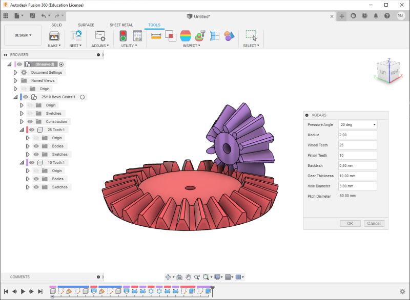

# bevel-gears
A Fusion 360 script that creates set of bevel gears from parameters

## Usage
Download the files and place in this directory:

-Windows\
C:\\Users\\{username}\\AppData\\Roaming\\Autodesk\\Autodesk Fusion 360\\API\\Scripts\

-Mac\
TBD\

Then start Fusion360. Select TOOLS, then ADD-INS -> Scripts and Add-ins. "Bevel Gears" should appear under "My Scripts"